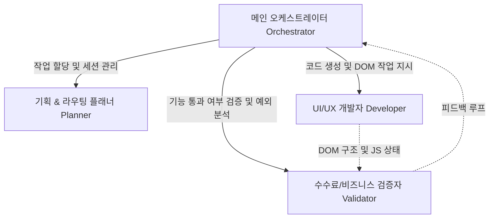

# AGENTS.md

> [!NOTE]
> 이 파일은 사람이 아닌 **AI 코딩 에이전트(Eats Pay Agent Team)**를 위해 작성된 전용 프로젝트 헌장(README for Agents)입니다.
> 에이전트가 이 코드베이스를 탐색하고 기능을 개발할 때, 본 설계도에 기재된 역할 분담, 세션 유지 정책, 그리고 통신 규칙을 100% 준수해야 합니다.

---

## 0. 최우선 UI/UX 일관성 지시서

모든 앱/관리자 화면 수정 전에는 반드시 [`docs/ui-consistency-directive.md`](docs/ui-consistency-directive.md)를 우선 확인하십시오.

특히 다음 원칙은 예외 없이 적용합니다.

* 기존에 완성된 화면을 먼저 찾아 기준으로 삼고, 새 스타일을 즉흥적으로 만들지 않습니다.
* 반복되는 `style=""` 인라인 CSS와 `onclick=""` 직접 바인딩을 새로 늘리지 않습니다.
* 버튼, 칩, 테이블, 모달, 카드, 입력창은 공통 클래스를 사용합니다.
* 수정 후 `npm run check:ui`, `node --check .\server.js`, `node --check .\js\app.js`를 기본 검증으로 수행합니다.
* 서버 반영이 필요한 변경은 로컬 수정으로 끝내지 않고 실제 운영 경로(`/opt/eatspay`) 반영까지 확인합니다.

---

## 0-1. 관리자 모드 안정화 고정 규칙

관리자 페이지 작업은 사용자가 반복해서 지적한 클릭 먹통, 디자인 회귀, 새로고침 상태 유실을 막는 것이 최우선입니다. 아래 규칙은 모든 관리자 화면 수정에 즉시 적용합니다.

### 활성 작업 경로

* 실제 관리자 운영 소스는 `D:\Avicx\eatspay\이츠페이_관리자_시스템_10.html`입니다.
* 운영 서버 반영 대상은 `/opt/eatspay/이츠페이_관리자_시스템_10.html`입니다.
* 로컬 미러나 임시 폴더만 수정하고 완료로 보고하지 않습니다.

### 클릭 이벤트 안정화

* 가맹점 목록, 대리점 목록, PG사 관리, FAQ, 공지사항, 이용가이드, 출금계좌 목록의 버튼/칩은 반드시 실제 클릭 검증까지 수행합니다.
* 링크형 이동은 `href="/admin?franchiseId=..."` 같은 실제 fallback URL을 유지하고, JS는 enhancement로만 사용합니다.
* 전역 click capture handler가 링크, 버튼, input, select, textarea, label 클릭을 막지 않도록 먼저 확인합니다.
* 행 클릭과 버튼 클릭이 겹치면 버튼/링크가 우선입니다. 행 클릭은 빈 영역 클릭에만 반응해야 합니다.

### 상세 화면과 새로고침

* 상세 화면은 URL 파라미터와 sessionStorage 양쪽에서 복구되어야 합니다.
* 새로고침은 로그인 화면이나 대시보드로 튕기면 안 됩니다. 현재 페이지의 데이터를 다시 받는 동작이어야 합니다.
* 로그아웃만 관리자 세션, 현재 페이지 키, 상세 id, 임시 필터를 비웁니다.

### 모달 규칙

* 관리자 모달은 바깥 배경 클릭으로 닫히면 안 됩니다.
* 닫기, 취소, 저장 버튼으로만 닫히게 합니다.
* 저장 실패 시 `Unexpected server error`만 보여주지 말고, 실패한 필드에 빨간 테두리나 구체 메시지를 표시합니다.

### 로그인 화면 규칙

* 로그인 화면에서는 비밀번호 칸으로 강제 focus 이동을 하지 않습니다.
* 아이디 저장 체크가 꺼져 있거나 사용자가 아이디를 지우면 저장된 아이디를 다시 자동 주입하지 않습니다.
* 로그아웃 후에는 처음 로그인 화면처럼 초기화합니다.
* 비밀번호 입력값은 표시/숨김 버튼으로만 전환하며, 입력 자체가 사라지면 안 됩니다.

### 디자인 고정 규칙

* 앱과 관리자 기본 폰트는 모두 `Pretendard`입니다.
* 메인 초록색은 `#03c75a`를 우선 사용합니다.
* 버튼, 칩, 테이블 헤더, 입력창, 모달은 기존 공통 클래스와 `docs/ui-consistency-directive.md` 기준을 따릅니다.
* 반복 인라인 CSS와 `onclick=""`을 새로 추가하지 않습니다.
* 인라인 CSS를 줄일 때 기능 이벤트가 바뀌지 않도록 화면별 클릭 검증을 함께 합니다.

### 검증과 배포

* 관리자 HTML 수정 후에는 HTML 안의 `<script>`를 추출해 `node --check`로 검증합니다.
* UI 수정은 브라우저에서 직접 클릭해 원래 문제가 해결됐는지 확인합니다.
* 운영 반영이 필요한 작업은 `scp`와 `ssh`로 서버 파일 반영까지 확인합니다.
* GitHub 푸시는 변경 범위를 확인한 뒤 관련 파일만 stage/commit/push 합니다.

---

## 1. 에이전트 팀 아키텍처 (Agent Team Architecture)

본 프로젝트는 **'오케스트레이터-스페셜리스트(Supervisor & Specialist)'** 모델을 채택하여 복잡한 태스크를 분할 정복합니다. Eats Pay 프로젝트에 특화된 4인 에이전트 팀의 역할은 다음과 같습니다.



### 👥 에이전트 프로필 및 책임 영역

1.  **메인 오케스트레이터 (Main Orchestrator - `orchestrator`)**
    *   **역할**: 전체 작업의 총괄 감독 및 상태 관리자.
    *   **핵심 의무**:
        *   사용자의 거대한 요구사항을 분석하여 단일 세션(Context)이 유실되지 않도록 관리.
        *   Planner, Developer, Validator의 상태를 기록하고 피드백 루프를 제어.
        *   각 에이전트 간의 데이터 통신을 조율하며 최종 검증 승인권(Sign-off)을 보유.

2.  **기획 & 라우팅 플래너 (UI/UX Router Planner - `planner`)**
    *   **역할**: 화면 전환 애니메이션 정책, 네비게이션 라우팅 설계자.
    *   **핵심 의무**:
        *   15개 서브 스크린(`index.html` 내 `.screen`)의 흐름과 되돌리기(`btn-back`) 세션 히스토리 보존 확인.
        *   사용자 여정(User Journey)상 꼬이는 라우팅 경로가 없는지 검증하고 동작 스펙 정의.

3.  **UI/UX 개발자 (Core Frontend Developer - `developer`)**
    *   **역할**: HTML 구조 조작, HSL 기반 프리미엄 CSS 제어 및 JS 인터랙션 구현 전문가.
    *   **핵심 의무**:
        *   `style.css`와 `js/app.js`에서 DOM을 조작하고 실시간 수수료 연동, 모달 온/오프 인터랙션 코드를 작성.
        *   태그 불일치 방지 및 코드 내 중복 스크립트 블록 완전 차단.

4.  **수수료/비즈니스 검증자 (Business Validator - `validator`)**
    *   **역할**: 실시간 비즈니스 데이터 무결성 검사 및 QA.
    *   **핵심 의무**:
        *   충전 수수료율(4.602%) 실시간 연산, 카드/가상계좌 CRUD 로직이 명세서대로 동작하는지 검증.
        *   로그 파일 점검, JS 콘솔 에러 유무 확인 및 닫는 태그(`</div>`) 검사 등 코드 무결성 검증.

---

## 2. 에이전트 간 통신 & 세션 유지 프로토콜

에이전트가 협업하여 세션을 유지하고 통신할 때 반드시 다음 통신 포맷과 상태 관리 원칙을 준수해야 합니다.

### 🔄 1단계: 세션 메타데이터 구조 (Session State Schema)
에이전트들은 `js/app.js` 내부의 전역 상태 객체(`state`)와 유사하게, 자신들의 태스크 상태를 공유 세션 메타데이터로 모니터링합니다.

*   **현재 화면 상태**: `state.currentScreen`
*   **히스토리 경로**: `state.history` (되돌리기 버튼 이벤트 추적용)
*   **통신 전달 객체 (Payload)**:
    ```json
    {
      "session_id": "eats-pay-session-2026",
      "active_agent": "developer",
      "target_screen": "charge",
      "payload": {
        "calculated_fee_rate": 0.04602,
        "input_amount": "100,000",
        "output_amount": "104,602"
      }
    }
    ```

### 💬 2단계: 에이전트 협업 커뮤니케이션 룰
*   **Developer**가 코드를 수정한 후에는 즉시 **Validator**에게 바통을 넘깁니다:
    > "Developer가 `index.html` L1429 영역의 닫히지 않았던 cs-promo div 블록을 수선 완료했습니다. Validator는 수선된 DOM 트리 밸런스 및 콘솔 컴파일 에러 유무를 즉시 검증하십시오."
*   **Validator**는 검증 결과를 **Orchestrator**에게 피드백합니다:
    > "Validator 검증 완료. `Balance of div tags: 0` 확인. JS 구문 컴파일 테스트 통과. 오케스트레이터에게 최종 화면 전환 통합 확인 및 배포 승인을 요청합니다."

---

## 3. 코드베이스 규칙 & 중요 경계 (Important Boundaries)

*   **서버/DB 연동 앱**:
    *   현재 프로젝트는 `server.js`, `db/repository.js`, `db/schema.sql`을 사용하는 Node.js/PostgreSQL 기반 서비스입니다.
    *   앱 화면은 `index.html`, `js/app.js`, `css/style.css`를 중심으로 동작하며, 관리자 화면은 `이츠페이_관리자_시스템_10.html` 단일 HTML 구조를 사용합니다.
    *   결제, 카드, 계좌, 관리자 데이터는 실제 DB와 API 상태를 기준으로 검증해야 합니다.
*   **HTML & CSS 샌드박스 구조**:
    *   모든 화면은 `#app-shell` -> `.phone-frame` -> `.screen-container` 내부에 종속적으로 렌더링되어야 합니다. 모바일 프레임 범위를 벗어나는 absolute/fixed 요소를 제한합니다.
*   **중복 스크립트 작성 절대 금지**:
    *   이전 턴의 sequential edit로 인해 `js/app.js` 하단에 동일 기능의 이벤트 바인딩이 중복 선언되는 현상을 엄격히 금지합니다. 수정 전 항상 파일의 전반적인 구조를 확인하십시오.

---

## 4. 빌드, 테스트 및 실행 가이드

*   **로컬 개발 서버 구동**: `python -m http.server 8080`
*   **검증 및 컴파일 검사**: `node -e "const js = fs.readFileSync('js/app.js', 'utf8'); new Function(js);"`
